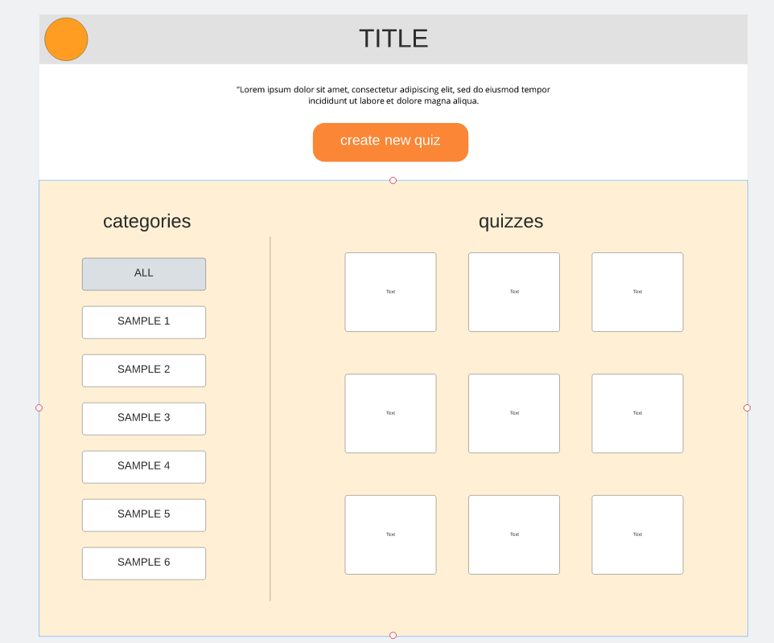
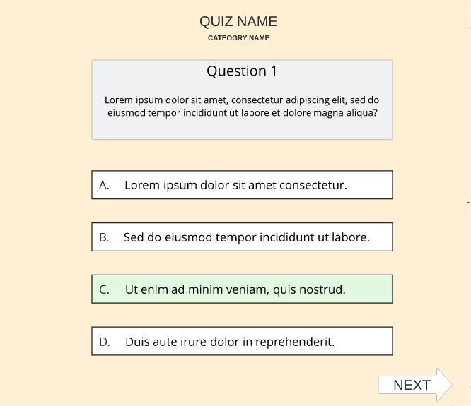
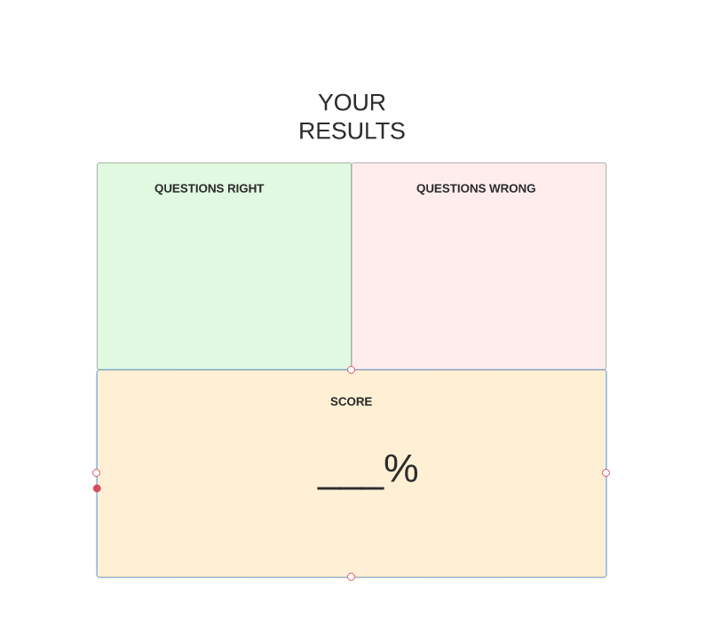

# **Quiz App Spring Back End**

## OBJECTIVE

The goal of Quizzle is to provide a platform that will allow you to not only search through different quizzes, but create your own as well. This app is a frontend application that will showcase the different quiz categories and their corresponding quizzes. It is built in conjunction with a backend Rest API that will allow a user to create different quizzes based on the category of their choosing. This frontend app was built using HTML, CSS, BootStrap, Javascript and Angular.

#### Links
- [Link to BackEnd App Repository](https://github.com/CodingVenus/Quiz-App-FrontEnd) 

- [Link to Deployed App on Heroku](https://quizzle-angular-app.herokuapp.com/)

### TOOLS AND TECHNOLOGIES USED
**DESIGN**
- LUCID CHART

**CODE**
- JAVASCRIPT
- TYPESCRIPT
- ANGULAR
- HTML
- CSS
- BOOTSTRAP

**DEPLOYMENT**
- HEROKU

## THE PLAN
- I planned for this application to be separated into at minimum 3 separate components.
        - My first wireframe designs included a Homepage, Quiz page, and Results page.
- Initially, I decided to focus on building out the functionality of the Quiz page. 
- I wanted users to be able to see:
        - The total number of questions in the quiz
        - Which number question they were currently on
        - An indicator that would let them know that their answer choice was right or wrong
        - Their current score
- Finally, after the last question they would be directed to a page dispalying their results.
- The home page would feature the list of categories as well as their corresponding quizzes, with buttons that would allow you to create a cateogry or quiz.

### WIRE FRAMES

## THE PROCESS
While building out the features for the quiz, I came to realize that it would be to my benefit to add even more modularity to the application. This meant creating a Questions List component.  

## CHALLENGES
I faced many challenges during this project that required a significant amount of research on my part. Some bigger issues included: 
- Building out the features of the quiz --> I had to learn more about event binding, building attribute directives, implementing ngOnInIt and more.
- Retrieving items based on the ID of their parent resource --> Activated routes, query param mapping, snapshots, etc.
- Getting the items retrieved from the database to appear without refresh (also fixing infinite request loop issues) --> Proeprly subscribing and unsubscribing from observables.

Overall, building this application provided a great opportunity for me to fine tune my Angular knowledge.

## UNFINISHED
- Multiple frontend CRUD functionality such as allowing users to create, update, and delete quizzes.

## USER STORIES -
                                                              
- [Click here](planning/UserStories.txt) to read the User Stories for this project.

## FUTURE DELIVERABLES
- Create User and Admin Authentication
